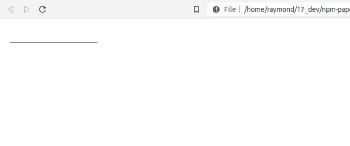
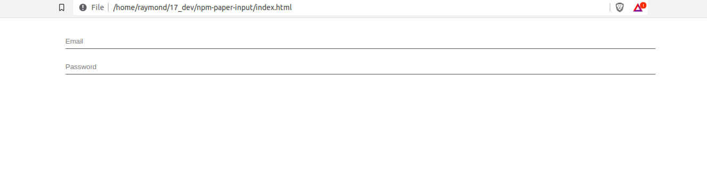
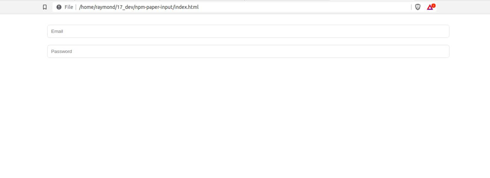

# paper-input

## Component's features

<ul>
  <li>Placeholder</li>
  <li>name</li>
  <li>fullwidth</li>
  <li>type</li>
  <li>required</li>
  <li>disabled</li>
  <li>value</li>
  <li>autofocus</li>
  <li>margin</li>
  <li>className</li>
  <li>variant</li>
</ul>

## How to use it

```
npm i hyper-paper-input
```

directory တစ်ခုဆောက်ပြီး terminal ‌ကနေ hyper-paper-input ကို install လုပ်လိုက်ပါ။
index.html ဆောက်ပြီး script tag နဲ့ paper-input.js ကို ချိတ်လိုက်ပါ။

```
-/node_modules 
-index.html 
```
### index.html
```
<body>
  ...
  <script src='./node_modules/hyper-paper-input/paper-input.js'></script>
</body>

```

```
<body>
  <paper-input></paper-input>

  <script src='./node_modules/hyper-paper-input/paper-input.js'></script>
</body>
```
### Result


## features
- Placeholder
- name

```
<paper-input
  placeholder="first name"
  name="first-name"
></paper-input>
```
name attribute လေးက input ရဲ့ နာမည်သတ်မှတ်တဲ့အခါ သုံးပါတယ်။

- fullwidth

fullwidth ပေးလိုက်ရင် သူ့ parent container ရဲ့ width ရှိသလောက် နေရာ ယူသွားပါလိမ့်မယ်။

```
<div class="container">
  <paper-input fullwidth></paper-input>
</div>
```

## Example

```
<paper-input
  placeholder="Email"
  type="email"
  required
></paper-input>

```

```
<div class="container">
  <paper-input
    placeholder="Email"
    type="email"
    required
    margin
    fullwidth
  ></paper-input>

  <paper-input
    placeholder="Password"
    type="password"
    required
    margin
    fullwidth
  ></paper-input>
</div>
```



- variant

```
<div class="container">
  <paper-input
    placeholder="Email"
    type="email"
    required
    margin
    fullwidth
    variant="outlined"
  ></paper-input>

  <paper-input
    placeholder="Password"
    type="password"
    required
    margin
    fullwidth
    variant="outlined"
  ></paper-input>
</div>
```
